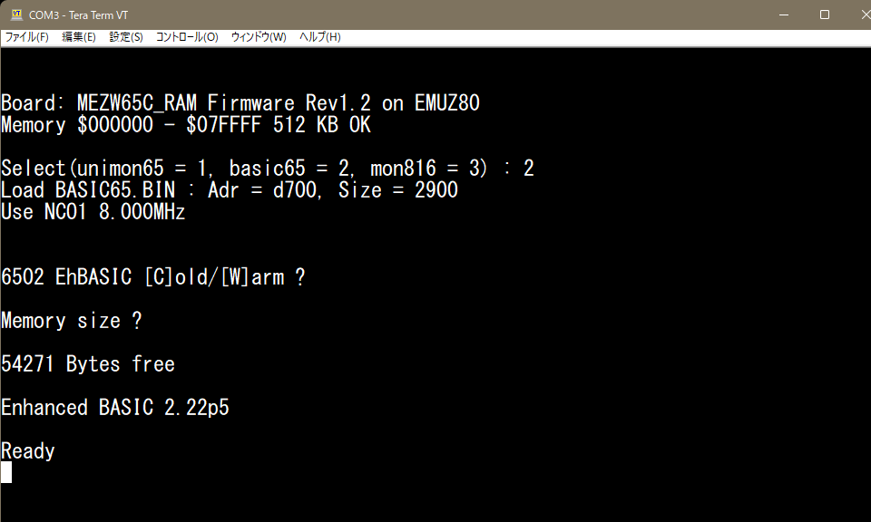

# MEZW65C_RAM 
 
EMUZ80で、W65C02Sを動かすメザニンボードとして、＠S_OkueさんのEMUZ80-6502RAM 
が2022年にGithubで公開されています。 
https://github.com/satoshiokue/EMUZ80-6502RAM
 
 
EMUZ80-6502RAMは、PIC18F47QXX（PIC18F47Q43/Q84/Q83）によってコントロール 
されています。とてもシンプルな構造となっており、6502に初めて触れる人には最適 
と言えます。 
 
EMUZ80は、電脳伝説さんが開発し公開されているSBCです。Z80の制御にPIC18F57Q43を 
使用し、最小限度の部品構成でZ80を動かしています。 
 
＜電脳伝説 - EMUZ80が完成＞   
https://vintagechips.wordpress.com/2022/03/05/emuz80_reference   
 
今回、W65C816Sと、W65C02S用に、512KBのメモリとSDカードI/Fを追加したメザニンボード、 
MEZW65C_RAMを作成しました。EMUZ80にアドオンすることで動作します。 
PIC18F47QXX（PIC18F47Q43/Q84/Q83）から、SDカード上にある6502用のプログラムを 
読み込んで、W65C816S/W65C02Sで実行させることが出来ます。
 

MEZW65C_RAMを搭載したEMUZ80 

 

MEZW65C_RAMM拡大 

# 特徴 
 
・CPU : W65C816Sまたは、W65C02相当 8MHz動作 
　　　　(W65C816S6TPG-14, W65C02S6TPG-14で確認） 
・Microcontroller : PIC18F47Q43, PIC18F47Q84, PIC18F47Q83 
・512K SRAM搭載(AS6C4008-55PCN) 
・μSDカードI/F（SPI) 
・UART（9600bps無手順） 
・動作ソフト（起動時に選択可能） 
　　1) Universal Monitor 6502 
　　2) 6502_EhBASIC_V2.22 
　　3) W65C816用ネイティブモニタ（sxb-hacker） 
 
      sxb-hackerは、WDC社で提供しているW65C816SXBトレーニング 
      ボード用に開発されたソフトでAndrew Jacobs氏が作成しました。 
      今回、このソフトをMEZW65C_RAM用に移植しました。 
      移植に際して、コマンドをなるべくユニバーサルモニタに合わせるように 
      変更してあります。？コマンドで見てください。 
      （https://github.com/andrew-jacobs/w65c816sxb-hacker） 
 
 

6502 EhBASIC V2.22の起動画面 

ASCIIARTの実行結果 

Universal Monitor 6502の起動画面 

W65C816Sのネイティブモニタ起動画面 

MEZ68K8_RAMシルク画像 

# ファームウェア（FW）
@hanyazouさんが作成したZ80で動作しているCP/M-80用のFWを 
(https://github.com/hanyazou/SuperMEZ80) 源流（ベース）にしています。 
今回は、MEZ68K8_RAM（https://github.com/akih-san/MEZ68K8_RAM） 用のFWを 
ベースにMWZW65C_RAM用のFWとして動作するように修正を加えました。 
 
 
# 開発環境 
・WDCTools 
アセンブラ、リンカーは、WDC社が提供するW65C816S/W65C02S開発ツールを使用しています。 
ここから、入手できます。 
https://wdc65xx.com/WDCTools 
 
・bin2mot.exe、mot2bin.exe 
モトローラフォーマットのヘキサファイルとバイナリファイル相互変換ツール 
ソースとバイナリファイルは、ここから入手できます。 
https://sourceforge.net/projects/bin2mot/files/ 
 
 
# その他のツール
・FWのソースのコンパイルは、マイクロチップ社の 
 
　「MPLAB® X Integrated Development Environment (IDE)」 
 
　を使っています。（MPLAB X IDE v6.20）コンパイラは、XC8を使用しています。 
（https://www.microchip.com/en-us/tools-resources/develop/mplab-x-ide） 
 
・FatFsはR0.15を使用しています。 
　＜FatFs - Generic FAT Filesystem Module＞ 
　http://elm-chan.org/fsw/ff/00index_e.html 
 

# PIC18F47Q43/Q84への書き込み
・snap 
マイクロチップ社の書き込みツールです。 
 
・PICkit3 
PICkitminus書き込みソフトを用いて、書き込むことが出来ます。以下で入手できます。 
http://kair.us/projects/pickitminus/ 
 
 
PICへの書き込みツールを用いて、ヘキサファイルを書き込みます。 
書き込み用のデータは8MHz用と、4MHz用の2種類用意しました。 
 
・PIC18F47Q43 
　　- R1.2q43_8MHz.hex 
　　- R1.2q43_4MHz.hex 
 
・PIC18F47Q84 
　　- R1.2q84_8MHz.hex 
　　- R1.2q84_4MHz.hex 
 
動作周波数の設定は、src/boardsにあるソースファイルw65_bd.cで修正できます。 
9MHz以上の設定も出来ますが、動作が不安定です。11MHz以上は動作しません。 
 
（注意事項） 
アクセスタイム55nsのメモリを使用しているため、10MHz付近が限界のようです。 
W65C02Sでは、10MHzで動作しています。 
W65C816Sでは、エミュレーションモードでは10MHzで動作していますが、ネイティブ 
モードに切り替えた場合、BANK0以外では10MHzで動作しませんでした。 
 
 
# ＯＳについて（今後の開発目標）
 
MEZW65C_RAM上で動作するＯＳの移植が、今後の課題です。 
レトロPCで6502界隈は、現在も非常にアクティブに開発が行われている 
ようです。 
 
・DOS/65 (http://www.z80.eu/dos65.html) 
・cpm65 (https://github.com/davidgiven/cpm65?tab=readme-ov-file) 
・miniOS (https://github.com/zuiko21/minimOS) 
・GeckOS (http://www.6502.org/users/andre/osa/index.html) 
 
< SDK > 
・LLVM-MOS SDK（https://github.com/llvm-mos/llvm-mos-sdk） 
 
<エミュレーター> 
・VICE（the Versatile Commodore Emulator） 
（https://vice-emu.sourceforge.io/） 
 
MEZW65C_RAMに移植するＯＳとして、GeckOSを検討しています。 
Linuxライクで非常にフレキシブルな構造をしたマルチタスクＯＳです。 
現在も開発が続いています。 
6502で、ここまでするかぁ～って感じですが、開発者André Fachatさんの 
すごい情熱を感じます。 
ドキュメントが半端なく揃えられていますが、物凄い量なので大変です。 
ファイルシステムは、FAT12をサポートしているとのことなので、 
MEZ88_RAMでMS-DOS V2.2を移植した同様の手口が使えるのではないかと思ってます。 
MS-DOSとかと違って、カーネルをソースから組み込む必要があり、GeckOS内部構造を 
きちんと理解する必要がありそうで、へっぽこボビーストにはかなりのハードルですね。 
 
ま、焦らず、ゆっくりと取り組んでいこうと思ってます。 
 
 

# 参考
＜EMUZ80＞ 
EUMZ80はZ80CPUとPIC18F47Q43のDIP40ピンIC2つで構成されるシンプルなコンピュータです。 
（電脳伝説 - EMUZ80が完成）   
https://vintagechips.wordpress.com/2022/03/05/emuz80_reference   
 
＜SuperMEZ80＞ 
SuperMEZ80は、EMUZ80にSRAMを追加しZ80をノーウェイトで動かすことができます。 
 
＜SuperMEZ80＞ 
https://github.com/satoshiokue/SuperMEZ80 
 
＜＠hanyazouさんのソース＞ 
https://github.com/hanyazou/SuperMEZ80/tree/mez80ram-cpm 
 
＜@electrelicさんのユニバーサルモニタ＞ 
https://electrelic.com/electrelic/node/1317 

＜オレンジピコショップ＞   
オレンジピコさんでEMUZ80、その他メザニンボードの購入できます。 
 
https://store.shopping.yahoo.co.jp/orangepicoshop/pico-a-051.html 
https://store.shopping.yahoo.co.jp/orangepicoshop/pico-a-061.html 
https://store.shopping.yahoo.co.jp/orangepicoshop/pico-a-062.html 
https://store.shopping.yahoo.co.jp/orangepicoshop/pico-a-079.html 
https://store.shopping.yahoo.co.jp/orangepicoshop/pico-a-087.html 
https://store.shopping.yahoo.co.jp/orangepicoshop/pico-a-089.html 
